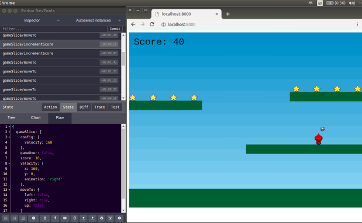
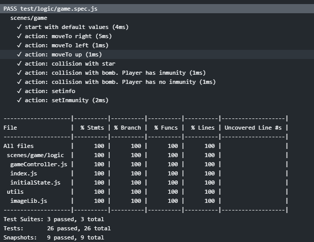

# phaser-redux

[](http://hits.dwyl.io/kfern/phaser-redux)

Este proyecto es un ejemplo de cómo usar redux para desarrollar juegos con Phaser 3, además de pretender ser una herramienta en Español para quienes estén interesados en aprender a programar juegos. En el siguiente enlace tienes ideas sobre [cómo y por qué usar redux con Phaser](docs/redux.md)

Combinar Phaser y Redux permite que el desarrollo de un juego sea más módular, fácil de depurar mediante Redux devTools y abre la posibilidad de automatizar los tests de la lógica del juego. 



El ejemplo está basado en el tutorial "Making your first Phaser 3 game" https://phaser.io/tutorials/making-your-first-phaser-3-game, utiliza "Phaser 3 Webpack Project Template" https://github.com/photonstorm/phaser3-project-template, "Redux Starter Kit" https://github.com/reduxjs/redux-starter-kit y "redux-watch" https://github.com/jprichardson/redux-watch

# Demo

Puedes jugar con la demo en https://kfern.github.io

La demo de la rama next está disponible en https://kfern.github.io/next.html

# Instalación
```
git clone https://github.com/kfern/phaser-redux.git 
cd phaser-redux
npm install
npm start
```
Si todo fue bien, puedes acceder con el navegador a http://localhost:8000

# Tests

Cualquier aplicación tiene que ser testada. Si se puede hacer de forma automática, mejor ;-)

Se ejecutan dos tests diferentes: Uno sobre la lógica y otro visual. 

En los tests visuales de esta versión se esperan unos segundos (menos de 30) para que el juego avance al menos hasta que todas las estrellas estén paradas. En ese instante se captura la pantalla y se comprueba si la diferencia entre esta captura y la imagen esperada es superior a un número de pixels. Solo deben ser diferentes la bola (que está en movimiento) y si el personaje ha sido alcanzado. A 800x600, con 850 es suficiente. 

Una vez instalada la aplicación se pueden ejecutar los tests mediante

```
npm test
```

En local se abre una ventana en el navegador. Se puede cerrar sin que afecte a los tests. Una posible mejora sería que no se mostrara.

Si todo ha ido bien, verás una salida como la siguiente:



El proyecto está integrado con GitHub Actions, por lo que cualquier cambio es [comprobado previamente de forma automática](https://github.com/kfern/phaser-redux/runs/407719648?check_suite_focus=true#step:4:128)

# Idioma
El idioma oficial de la documentación y gestión del repositorio es el Español, por lo que no es necesario usar el idioma inglés para abrir o comentar un "Issue" o en los "Pull request" o hacer cualquier pregunta.

Por otra parte, el idioma para los comentarios en el código fuente es el inglés. Si envías un PR y no tienes nivel suficiente puedes usar Google Translate.

# Posibles mejoras
Lista de mejoras que se podrían implementar. Quien esté intesado en colaborar puede enviar un PR o abrir un Issue.
* ~~Poder jugar con pantalla táctil y ratón.~~ Versión 1.1.0
* ~~Adaptar el tamaño del juego al de la pantalla.~~ Versión 1.3.0. @gammafp
* ~~Añadir tests de ejemplo.~~
* Ampliar la documentación https://github.com/kfern/phaser-redux/issues/10
* Refactorizar estrellas y bombas para que sean clases independientes.
* Añadir en el estado todo lo necesario para poder ver con devTools la pantalla completa en cada instante. Ahora sólo se gestionan la puntuación y la animación que se aplica al player.