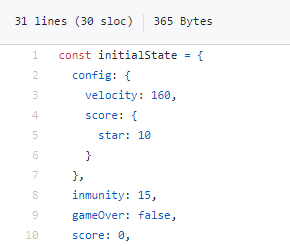

# Qué es redux (sin entrar en detalles técnicos)

## Tres principios fundamentales

Tal y como se describe en el sitio oficial,

"Redux puede ser descrito en tres principios fundamentales:
[...]
Única fuente de la verdad
El estado de toda tu aplicación esta almacenado en un árbol guardado en un único store.
[...]
El estado es de solo lectura
La única forma de modificar el estado es emitiendo una acción, un objeto describiendo que ocurrió.
[...]
Los cambios se realizan con funciones puras
Para especificar como el árbol de estado es transformado por las acciones, se utilizan reducers puros."

https://es.redux.js.org/docs/introduccion/tres-principios.html

## ¿Qué significa ...

### Única fuente de la verdad: El estado de toda tu aplicación esta almacenado en un árbol guardado en un único store.

Desde un punto de vista de la programación de juegos con Phaser, el estado sería el conjunto de variables que se usan en una escena y que determinan el comportamiento de los elementos que intervienen en el juego.

En redux el estado es un objeto json. 

En este objeto se almacena la puntuación (score), si el juego ha terminado (gameOver), etc

El estado inicial de este juego se encuentra en https://github.com/kfern/phaser-redux/blob/refactor-logic/src/scenes/game/logic/initialState.js

### El estado es de solo lectura
El valor de una variable del estado no se puede modificar directamente. Para realizar algún cambio hay que ejecutar una acción. 

### Los cambios se realizan con funciones puras
Las acciones a las que se refiere el punto anterior no son más que funciones. Para cambiar un valor del estado hay que ejecutar una función. En redux los términos "acción" y "reducer" son sinónimos de función.

Esto significa que para cambiar el valor de score en el estado del juego se necesita una función que lo modifique.

Por ejemplo, la puntuación en esta versión del tutorial aumenta cuando se produce una colisión entre el jugador y una estrella. La colisión se detecta en la escena, por lo que habrá que ejecutar una acción en ese momento.

Desde la escena se actualiza la puntuación ejecutando la acción "collision" y pasándole una cadena que indica el objeto con el que se ha colisionado.

`this.gameStore.dispatch(gameController.actions.collision('star'));`

- this.gameStore.dispatch => Ejecutar una acción
- gameController.actions.collision => La acción o "reducer" se llama "collision"
- ('star') => Parámetros que se pasan a la función collision.

https://github.com/kfern/phaser-redux/blob/refactor-logic/src/scenes/game/GameScene.js#L147

La función en la que se actualiza la puntuación se llama "collision" y se define en https://github.com/kfern/phaser-redux/blob/refactor-logic/src/scenes/game/logic/gameController.js#L35

# ¿Por qué usar redux para diseñar un juego con phaser?

# Como se usa redux en esta versión del tutorial

