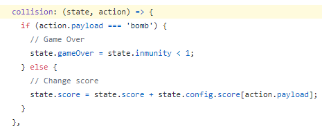

# ¿Por qué usar redux para diseñar un juego con phaser?

¿Te reconoces en alguna de estas situaciones?

- Cuando trabajas sobre un juego dedicas mucho tiempo en la pantalla de un navegador haciendo comprobaciones.
- Ciertos errores son difíciles de reproducir y después de corregidos pueden aparecer de nuevo.
- Dos personas diferentes no podemos trabajar sobre la misma escena.
- Me gustaría añadir en un futuro la posibilidad de que sea multijugador o incorporar una AI.

Si te identificas con alguno de estos puntos, entonces puedes seguir leyendo ;-)

En Phaser la lógica y la vista se desarrollan en la escena. Usando redux se pueden separar. 

- Por ejemplo, en esta versión del juego cuando el jugador es alcanzado por una bomba el juego termina. La programación se puede separar de forma que:
  - En la escena sólo se compruebe (consultando el estado) si el juego continua activo. En ese caso se cambia el color del jugador y no se ejecuta nada más.
  - La escena informa (ejecutando una acción) cuando se produzca una colisión entre el player y una estrella o una bomba.

Una escena en Phaser no es sencilla de testar de forma automática. Todo lo que se implemente usando redux si.

- Por ejemplo, usando redux he creado una acción que permite a la escena informar de que se ha producido una colisión entre el jugador y una estrella o bomba:
  - Estado antes de ejecutar la acción: 
    - score: 0, gameOver: false
  - Ejecutar acción collision('star')  
  - Estado después de ejecutar la acción: 
    - score: 10, gameOver: false => Sólo cambia score de 0 a 10
  - Ejecutar acción collision('bomb')
  - Estado después de ejecutar la acción: 
    - score: 10, gameOver: true => Sólo cambia gameOver de false a true

- Las acciones en redux son funciones puras en javascript: Con unos datos de entrada determinados siempre se producirá el mismo resultado, por lo que un caso como el anterior es muy fácil de comprobar. Tan sólo hay que preparar el estado inicial, ejecutar la acción y comprobar cómo se ha modificado el estado. Si el estado no es el esperado el test no se habría pasado.

Cuando se usa Redux la forma de organizar el código es bastante similar a la del modelo cliente/servidor, por lo que usarlo simplifica los cambios necesarios para pasar un juego a multijugador o para incorporar nuevas formas de interactuar con el juego. ¿Está preparado tu juego para usarlo mediante gestos o movimientos corporales?

En resumen, usando redux:

- Se puede separar en la escena la lógica de la vista.
- La lógica se puede testar de forma sencilla y automática.
- El juego esta preparado para crecer, tanto en número de jugadores como añadiendo interacción mediante visión artificial, dispositivos IoT o lo que aparezca en un futuro.
- Se duerme con más tranquilidad. ;-)

# Como se usa redux en esta versión del tutorial

Redux es muy flexible y se le puede dar el uso que se necesite. Este proyecto es sólo un ejemplo. Si quieres ideas sobre cómo se podría usar en tu juego puedes abrir un Issue.

En esta versión he implementado mediante redux las siguientes acciones:

- moveTo: Recibe un objeto que indica hacia donde se quiere mover el jugador: { left: false, right: false, up: false}
- setInmunity: Recibe un número que se va reduciendo cuando se ejecute una acción moveTo. Si se tiene inmunidad el juego no termina aunque se produzca una colisión con una bomba. Al iniciarse el juego se cuenta con una cantidad de inmunidad (que se define en el estado inicial). 
- collision: Recibe una cadena. Si es 'star' aumenta la puntuación. Si es 'bomb' termina el juego, sólo en el caso de que el jugador no tenga inmunidad.
- setInfo: Recibe un objeto que es creado en la escena. Tengo pensado usarlo en un futuro para obtener información sobre el juego en tiempo real.

El estado inicial es el siguiente:

    const initialState = {
        config: {
            velocity: 160,
            score: {
                star: 10
            }
        },
        inmunity: 15,
        gameOver: false,
        score: 0,
        velocity: {
            x: 0,
            y: 0,
            animation: 'turn'
        },
        moveTo: {
            left: false,
            right: false,
            up: false
        },
        info: {
            player: {
                x: 0,
                y: 0
            }
        }
    };

# Qué es redux (sin entrar en detalles técnicos)

## Tres principios fundamentales:

- Única fuente de la verdad
    - El estado de toda tu aplicación esta almacenado en un árbol guardado en un único store.
- El estado es de solo lectura
    - La única forma de modificar el estado es emitiendo una acción, un objeto describiendo que ocurrió.
- Los cambios se realizan con funciones puras
    - Para especificar como el árbol de estado es transformado por las acciones, se utilizan reducers puros."

https://es.redux.js.org/docs/introduccion/tres-principios.html

## ¿Qué significa ...

### Única fuente de la verdad: El estado de toda tu aplicación esta almacenado en un árbol guardado en un único store.

Desde un punto de vista de la programación de juegos con Phaser, el estado sería el conjunto de variables que se usan en una escena y que determinan el comportamiento de los elementos que intervienen en el juego.

En redux el estado es un objeto json. 

En este objeto se almacena la puntuación (score), si el juego ha terminado (gameOver), etc

El estado inicial de este juego se encuentra en https://github.com/kfern/phaser-redux/blob/master/src/scenes/game/logic/initialState.js

### El estado es de solo lectura

El valor de una variable del estado no se puede modificar directamente. Para realizar algún cambio hay que ejecutar una acción. 

### Los cambios se realizan con funciones puras

Las acciones a las que se refiere el punto anterior no son más que funciones. Para cambiar un valor del estado hay que ejecutar una función. En redux los términos "acción" y "reducer" son sinónimos de función.

Esto significa que para cambiar el valor de score en el estado del juego se necesita una función que lo modifique.

Por ejemplo, la puntuación en esta versión del tutorial aumenta cuando se produce una colisión entre el jugador y una estrella. La colisión se detecta en la escena, por lo que habrá que ejecutar una acción en ese momento.

Desde la escena se actualiza la puntuación ejecutando la acción "collision" y pasándole una cadena que indica el objeto con el que se ha colisionado.

`this.gameStore.dispatch(gameController.actions.collision('star'));`

- this.gameStore.dispatch => Ejecutar una acción
- gameController.actions.collision => La acción o "reducer" se llama "collision"
- ('star') => Parámetros que se pasan a la función collision.

[Enlace a la escena donde se ejecuta la acción](https://github.com/kfern/phaser-redux/blob/master/src/scenes/game/GameScene.js#L147)

La función en la que se actualiza la puntuación se llama "collision" y se define junto con el estado.

[Enlace al reducer en el que se define la acción](https://github.com/kfern/phaser-redux/blob/master/src/scenes/game/logic/gameController.js#L35)

